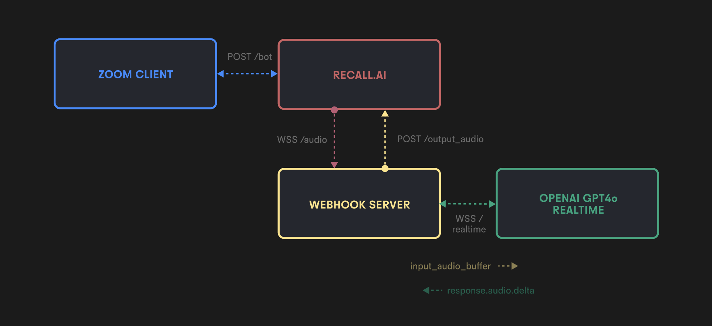

## 🤖 Real-time AI Assistant for Zoom Meetings (Built with OpenAI's Realtime API and Recall.ai)

This project features a real-time AI assistant for Zoom meetings, powered by OpenAI’s [Realtime API](https://platform.openai.com/docs/guides/realtime) API and the [Recall.ai](https://recall.ai) API. The assistant joins meetings and provides intelligent, context-aware responses based on the ongoing conversation.

**Disclaimer:** This proof-of-concept showcases the potential of Recall.ai and OpenAI’s Realtime API. It is not production-ready and requires further development, especially regarding ethical considerations, privacy, and legal compliance.



## Prerequisites

This project assumes you've already:
- Set up a [Recall.ai](https://recall.ai) account
- Created a Zoom app and added your credentials to the Recall.ai dashboard
- Created an [OpenAI](https://openai.com) account and obtained an API key

## Setup and Running the Bot

1. Clone this repository and install the required dependencies:
   ```
   pip3 install -r requirements.txt
   ```

2. Create a `.env` file in the project root and add the following environment variables:
   ```
   RECALL_API_KEY=your_recall_api_key
   OPENAI_API_KEY=your_openai_api_key
   ZOOM_MEETING_URL=your_zoom_meeting_url
   ```

3. Run the main application:
   ```
   python3 api.py
   ```

## How It Works

1. The application starts and uses ngrok to create a secure tunnel to the local webhook server.
2. A new Recall.ai bot is created using the Recall.ai `/bot` API endpoint and joins the Zoom meeting URL specified in the .env file.
3. Once you admit the bot into the Zoom meeting, it will begin streaming S16LE PCM audio from the meeting back to the ngrok webhook server via websocket.
4. The webhook server establishes a concurrent websocket connection with OpenAI's Realtime API, and begins forwarding the audio stream from the meeting to the OpenAI websocket.
5. The OpenAI websocket processes the audio stream and begins sending server events back to the webhook server.
6. We listen for the `response.audio.delta` event, which contains chunks of the base64 encoded audio stream of the AI's response. We concatenate these chunks into a complete audio buffer.
7. Once we receive the `response.audio.done` event, we transcode the audio buffer using pydub and stream the audio generation back to the Zoom meeting via the Recall.ai `/output_audio` API endpoint.

## Bot Customization

- You can modify the assistant's system prompt in the `update_session` method of the `OpenAIRealtime` class in `openai.py`. The default prompt is set to provide sales assistance.

## Limitations

- Recall.ai's API uses POST requests for outputting audio, which can cause delays in bot responses.
- Inconsistent bot audio stopping / overlapping in Recall.ai's API makes it hard to implement real-time interruptions supported by OpenAI's Realtime API.
- These limitations hinder full use of OpenAI's Realtime API features, especially for dynamic conversations.
- The OpenAI Realtime API is quite expensive, which is a significant consideration for implementation and ongoing usage. In this project, we attempt to mitigate this by only allowing the bot to respond when the wake word is detected.

## Future Improvements

- Incorporate a knowledge base for the AI assistant to use as context e.g. product features, pricing, documentation, etc.
- Add function calling to the OpenAI real-time API to allow the AI assistant to perform specific tasks e.g. send follow up emails, create tasks in Jira, etc.
- Add support for other meeting platforms e.g. Google Meet, Microsoft Teams, etc.

## Contributing

Contributions are welcome! Please feel free to submit a Pull Request.

## License

[MIT License](LICENSE)